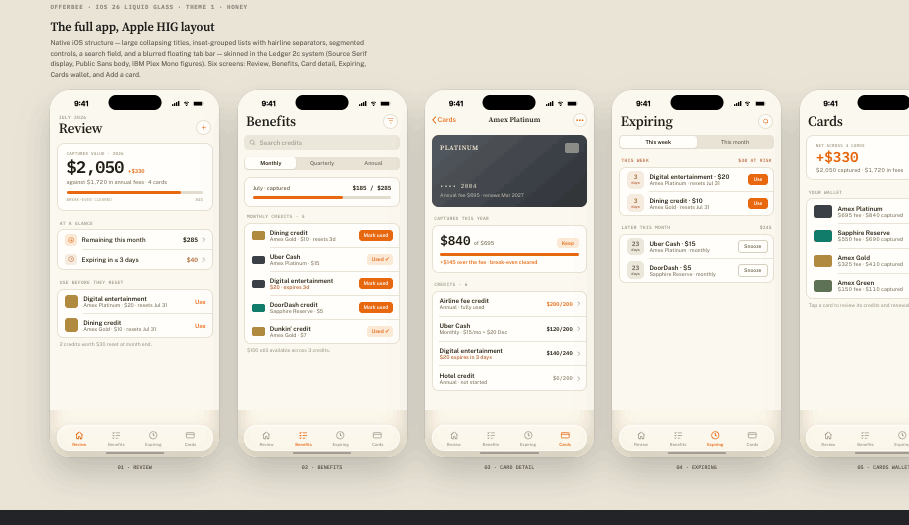
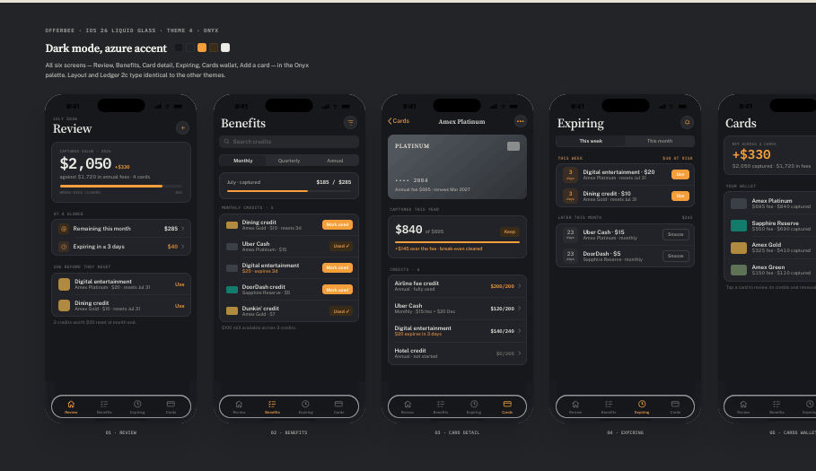

<div align="center">


# OfferBee

### Make every annual fee earn its keep.

**OfferBee** is a credit-card **benefits & statement-credit tracker.** See what's still
available this period, what's about to expire, and whether each card's annual fee is
actually paying for itself — then make a confident keep-or-downgrade call at renewal.

No bank login. Credits are tracked manually or via CSV import.

<br />


</div>

---

## The app

<div align="center">

**Honey** — light theme



**Onyx** — dark theme



</div>

---

## The core loop

A calm **monthly review**, not a spreadsheet:

1. **See where you stand** — captured value vs. annual fees, at a glance.
2. **Use credits before they reset** — dining, travel, entertainment, and more.
3. **Decide at renewal** — every card gets a **Keep** or **Review** verdict once you can
   see whether it earned its fee back.

> _"$2,050 captured this year · +$330 over $1,720 in fees across 4 cards."_

---

## Features

| Screen | What it does |
| --- | --- |
| 🏠 **Review** | Home dashboard — captured value, remaining this period, and credits expiring in ≤3 days. |
| 🧾 **Benefits** | Every credit across all cards, grouped by reset cycle (Monthly / Quarterly / Annual). One tap to **mark used**. |
| 💳 **Card detail** | One card's fee ROI + all its credits, with per-credit progress and a **Keep** badge once it clears its fee. |
| ⏳ **Expiring** | Countdown reminders for credits at risk this week / this month. **Use** or **Snooze**. |
| 👛 **Cards wallet** | All cards + portfolio net value; entry point to each card's fee review. |
| ➕ **Add a card** | Add from a catalog of 65+ premium cards, or import via CSV. No bank login. |

Backed by **push reminders** (Expo notifications) so a credit never quietly expires, and an
AI-assisted **catalog review** pass that keeps card benefit data accurate.

---

## Tech stack

- **Web** — [Next.js 16](https://nextjs.org) (App Router, React 19), Tailwind CSS 4, Radix UI
- **Native** — [Expo SDK 55](https://expo.dev) (Expo Router), React Native
- **Backend** — [Convex](https://convex.dev) (reactive DB + serverless functions + crons)
- **Auth** — [Clerk](https://clerk.com) (web + native, social login)
- **Card catalog** — Rewards Credit Card API via RapidAPI
- **AI review** — OpenRouter (benefit-data validation)
- **Tooling** — pnpm workspaces + Turborepo, TypeScript, Prettier
- **Deploy** — Netlify (web) + Convex (backend), automated staging deploy on merge to `preview`, production on merge to `main`

### Monorepo layout

```
offerbee/
├── apps/
│   ├── web/            # Next.js 16 app (package: web-app)
│   └── native/         # Expo app       (package: native-app)
├── packages/
│   └── backend/        # Convex backend + generated API types (@packages/backend)
├── logos/              # brand assets
└── Design/             # design handoff (tokens, screens, references)
```

Convex tables: `users`, `cardCatalog`, `cardDetails`, `cardDataReview`, `userCards`,
`pushTokens`, `notifications`.

---

## Quick start

**Prerequisites:** Node ≥ 20.20, pnpm 10, a [Convex](https://convex.dev) account, and a
[Clerk](https://clerk.com) app.

```sh
# 1. Install dependencies
pnpm install

# 2. Configure Convex — logs you in, creates/links the project,
#    and writes packages/backend/.env.local
pnpm --filter @packages/backend setup

# 3. Fill in the app env files (see Environment below), then run everything
pnpm dev
```

`pnpm dev` starts the Convex dev server, the Next.js web app, and the Expo native app
together via Turbo.

### Environment

Secrets live in git-ignored `.env.local` files — never commit them.

**`apps/web/.env.local`**
```sh
NEXT_PUBLIC_CONVEX_URL=            # from step 2 (Convex deployment URL)
NEXT_PUBLIC_CLERK_PUBLISHABLE_KEY=pk_test_...
CLERK_SECRET_KEY=sk_test_...
```

**`apps/native/.env.local`**
```sh
EXPO_PUBLIC_CONVEX_URL=            # same Convex URL as web
EXPO_PUBLIC_CLERK_PUBLISHABLE_KEY=pk_test_...
```

**Convex dashboard** (Project Settings → Environment variables — not files):
```sh
CLERK_JWT_ISSUER_DOMAIN=https://...   # required — enable Clerk's Convex integration to get it
RAPIDAPI_KEY=...                       # Rewards Credit Card API — powers card search/detail
OPENROUTER_API_KEY=...                 # optional — AI catalog review
OPENROUTER_MODEL=...                   # optional — model id for the review pass
EXPO_ACCESS_TOKEN=...                  # optional — higher Expo push limits
```

---

## Commands

| Command | Does |
| --- | --- |
| `pnpm dev` | Backend + web + native together (Turbo) |
| `pnpm --filter web-app dev` | Next.js only |
| `pnpm --filter native-app dev` | Expo only (`i` / `a` for simulators, or scan the QR) |
| `pnpm --filter @packages/backend dev` | Convex dev server only |
| `pnpm build` | Build the whole workspace |
| `pnpm typecheck` | Type-check every package |
| `pnpm format` | Prettier across the workspace |

---

## Deployment

Push to open a PR → an isolated **Convex + Netlify preview** spins up automatically.
Merge to the default branch → promotes to production. See [`DEPLOYMENT.md`](DEPLOYMENT.md)
for the full branch model, required secrets, and rollback steps.

---

## Design

OfferBee follows iOS 26 (Liquid Glass) conventions over the **"Ledger"** type system —
Source Serif 4 for titles, Public Sans for UI, IBM Plex Mono for every figure (tabular
digits, so numbers align like a statement). Two themes: **Honey** (light) and **Onyx**
(dark). Full tokens and screen specs live in [`Design/`](Design/).
